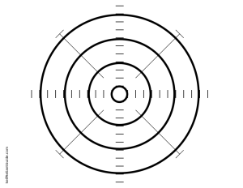

Here are a couple targets that I have created.  All targets on this page are freely usable and distributable by anyone.  They have been created with printability in mind, intended to be used on 8.5" &times; 11" paper.

[License]: http://creativecommons.org/licenses/by-sa/3.0/

This is just a basic, fun target.  The lines on the target are spaced at about 1.25 inches.

> [PDF](target.pdf), [PNG](target.png), [SVG](target.svg)

Useful for sighting in rifles, this target has lines spaced every inch.

> [PDF](target-grid.pdf), [PNG](target-grid.png), [SVG](target-grid.svg)

Handgun correction charts.  If you are consistenly off in a particular direction, this will let you know how to fix your aim.

> Right handed shooters: [PDF](correction-right.pdf), [PNG](correction-right.png), [SVG](correction-right.svg)

Lefties aren't forgotten either!  This is just a mirror image of the right handed version.

> Left handed shooters: [PDF](correction-left.pdf), [PNG](correction-left.png), [SVG](correction-left.svg)
